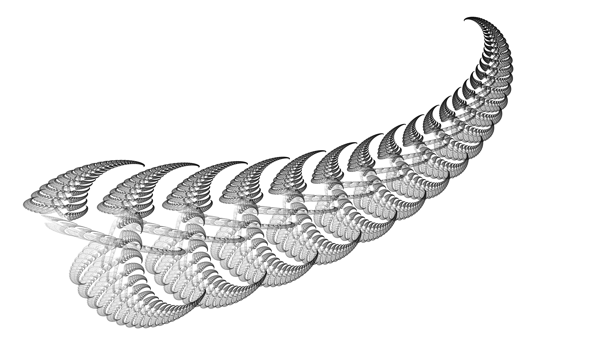
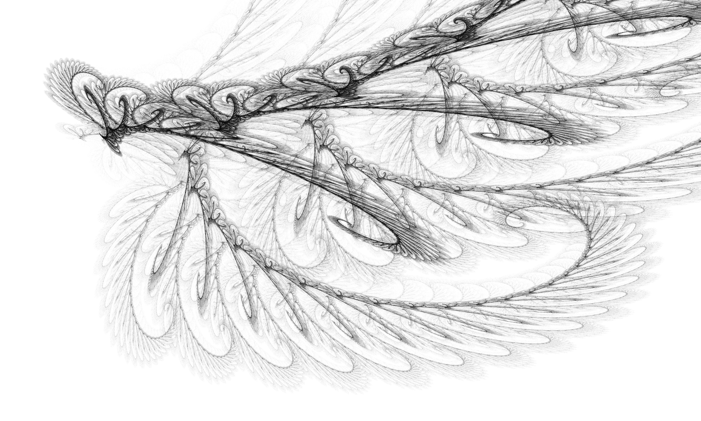
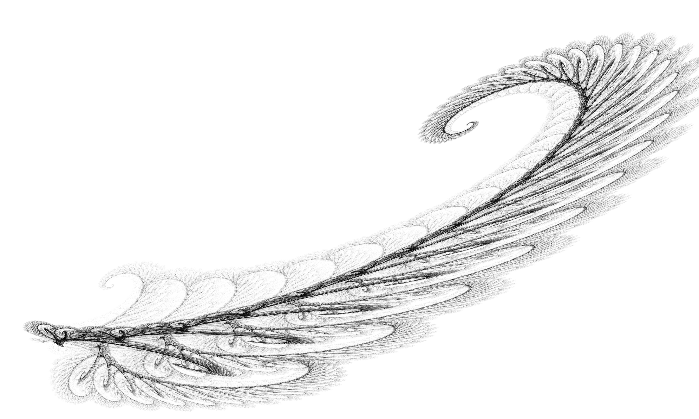
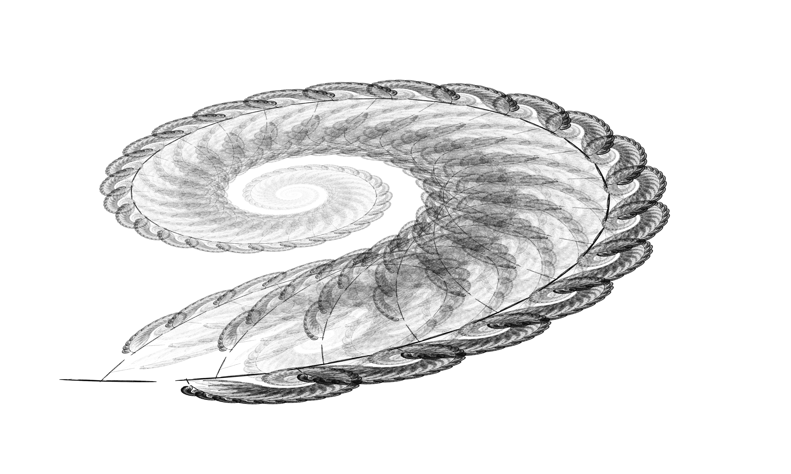
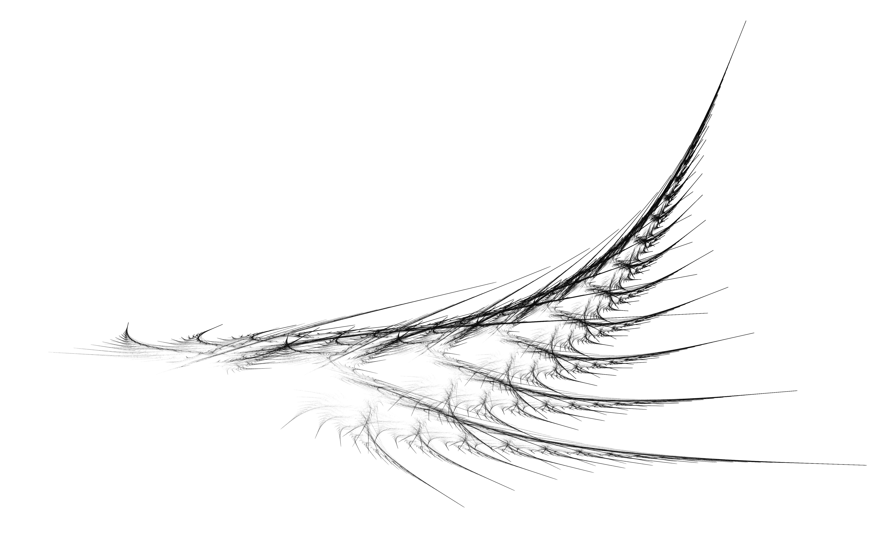

# Barnsley-Fern-Variations
I explore what can be done with the algorithm which generates the Barnsley Fern but using different parameters.

The original Barnsley Fern:

 

## What has been done

I explored the parameter space at random and found some parameters for which I find the corresponding fractal beautiful, using Processing. Here are some of the results I got:

 
 
 
 

I recorded the transition between different fractals by switching the program to filming mode, and making a film out of the output images using the built-in function of processing. I got the following result: https://youtu.be/ANUTxByaV7I

## How to run the program

Open the .pde file using Processing. You can switch between the different fractals I found using the arrow keys, find new ones using the r key and save the current one by pressing the s key. Edit the code and set the "filming" variable to true to get generate the images which can be used to generate a film like I did.
